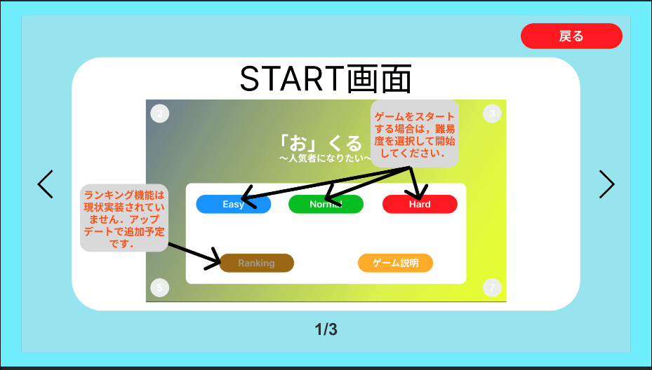

# ゲーム：「お」くる　詳細ページ

#### [TopPage へ](README.md)

## ゲーム概要

「お」があなたに向かってきます笑．クリックまたは，タップをしてやってくる「お」だけを倒してください．「お」が規定より近づいたらあなたの負けです．
「お」を倒す簡単シューティングゲーム？？ゲームタイトル通り，あなたに向かって「お」向かってきます．Unity ゲームジャムのお題である「おくる」を考えた時に，「お」と「来る」に分割しようと思い，このゲームを思いつきました．「お」は，ひらがなだけが出てくるわけではありません．「オ」や「o」，「尾」などが出てきます．それを倒してください．「お」以外も来ますが，倒していいのは「お」だけです．60 秒という時間の中で「お」をしっかり倒すゲームです．「お」がゲームオーバーで，「お」以外を倒すと時間が減少する．「お」を倒すと時間が加算されます．遊ぶことができた時間をできる長くするゲームです．

## ゲーム説明

- 「お」と読みものが出てくる．これをクリックまたは，タップして倒していく．<br>
  <例>「お」，「オ」，「o」，「尾」，「御」，「押」などが出てくる
- 「お」以外の読みのものも出てきます．これはクリック，タップせずにスルーしてください<br>
  <例>「い」，「烏」，「夢」，「む」などが出てくる
- 一つの文字の考えれる時間は「2 秒」です．それを超えると「お」と読むものの場合は，ゲームオーバです．「お」と読まない場合は，そのまま進みます．
- 40 秒という時間の中で「お」と読み物を倒して，「お」と読まないものは，そのままスルーします．そのなかで，「お」を倒すと 1 秒追加されます．「お」と読まないものを倒すと時間が「-3 秒」されます．「お」と読まないもは画面をタップせずに 2 秒間待っていれば次の文字に変更されます．

## [ゲームの拡張・エラー・バグについて](game_expand_error.md)

## ゲーム画像

### StartScene

 <br>

```
ゲーム開始時の画面です．
- 難易度を選択してゲームを始めてください．
- ゲームの説明は，「ゲーム説明」から確認してください．
```

### GameScene

<br>
<br>
<br>

```
ゲーム画面です．
- 画面をクリックしてゲームを開始します．
- 40秒間ゲームを行なって，画面上に出てくる文字をクリックして倒して進めてください．
- 終了したら，画面をクリックして結果画面へ遷移してください．
- 表示される文字が時間経過で大きくなる
- 倒した時に制限時間の増減が表示される
```

### ResultScene

<br>

```
ゲームの結果画面です．
- ゲームを行えた時間が表示されます．
- クリックするとStartSceneに戻ります．
- 倒した文字一覧を表示
- ゲームオーバになった文字表示
```

### ExplainGameScene

<br>

```
ゲーム説明画面
- ゲームの簡単なやり方を説明しています．
```

### SecretScene

<br>

```
シークレットシーンです．普通にこのページに遷移することはできません．探してみてください．
- このゲームの本当の意味を知ることができます．
```

### ゲームのプレイ動画　※ネタバレ注意

GoogleDriveURL:[https://drive.google.com/drive/folders/1BAYc3_ENDM0UjTK3_W5smHmHbnKhcaT1?usp=drive_link](https://drive.google.com/drive/folders/1BAYc3_ENDM0UjTK3_W5smHmHbnKhcaT1?usp=drive_link)
